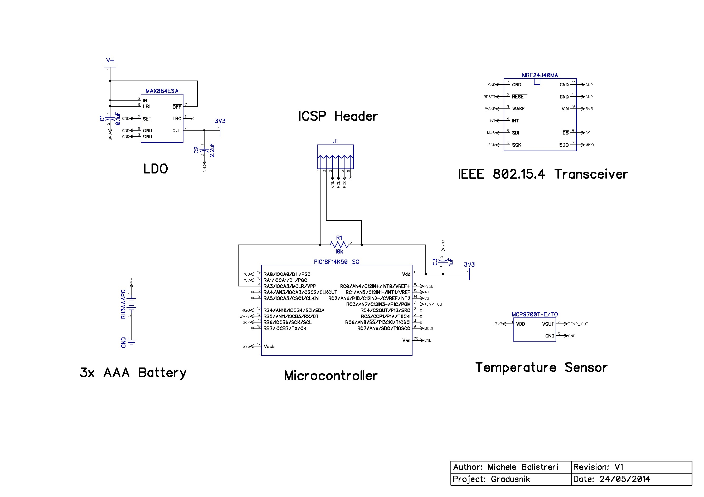
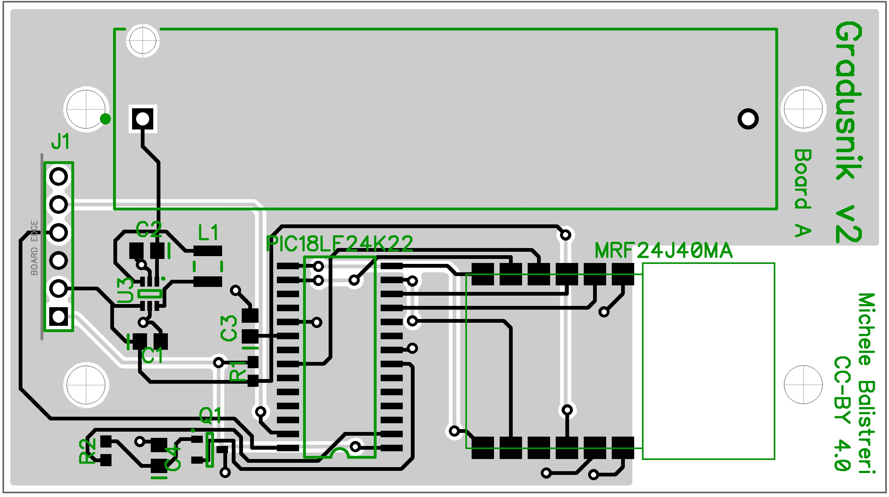

Gradusnik
=========

Gradusnik is an OSNP-compatible Thermometer for PIC18LF24K22 + MRF24J40. This is the first project implementing the [OSNP](https://github.com/briksoftware/osnp) protocol and provides an example of how to use it.

Gradusnik is just above 9k when compiled with xc8 (Pro) for the PIC18F24K22 and includes the OSNP-stack, the MRF24J40 driver and the device-specific logic. Nonetheless, the entire OSNP protocol is implemented, including security.

You can use this project as basis to create your own OSNP-based device, performing other functions than sensing temperature.

## Schematics & PCB

These are the current schematics...

...and PCB design

## Bill of materials

* 1x [PIC18LF24K22](http://www.microchip.com/wwwproducts/Devices.aspx?dDocName=en547749)
* 1x [MRF24J40MA](http://www.microchip.com/mrf24j40ma)
* 1x [MCP9700](http://www.microchip.com/wwwproducts/Devices.aspx?product=MCP9700)
* 1x [LTC3525-3.3](http://www.linear.com/product/LTC3525)
* 1x 10µH inductance
* 1x 10kΩ resistor
* 1x 200Ω resistor
* 3x 1µF Ceramic capitor
* 1x 22µF Ceramic capitor
* 1x Keystone 1028 battery holder
* 6x Header pins with 2,54mm spacing for the ICSP header 

If you intend to use the provided PCB design, download the DipTrace Schematics/PCB for details about the footprint of the components.

## How to compile

A compile script will be added, but in the meantime you can compile it manually.

### Step 1: Download dependencies

* [OSNP Protocol Stack](https://github.com/briksoftware/osnp)
* [MRF24J40 Driver](https://github.com/briksoftware/mrf24j40)

You can either leave each project in its own folder or copy all the .c and .h files in the same folder (which is easier).

### Step 2: Create MPLAB X Project

Create an MPLABX project, choose PIC18LF24K22 as target and select your programmer/debugger device. Import all source files. If you copied all source/header files in the same directory, you can just hit "compile" and you are done.

Otherwise you will have to play with the project settings and explictly add the include directories. The setup where each project mantains its own directory simplifies contributing your changes back.

Alternatively, you can invoke xc8 from the command line.

### Step 3: Customize

In the main.c file you will see the content of the EEPROM. It is advisable to change the 64-bit address (default: 703D6263962C9BF2) and the pairing key (default: 000102030405060708090A0B0C0D0E0F).

## How to use

Now you have a working Gradusnik, or whatever device you derived from it. Now the device can be used with any OSNP-compatible Hub, like [Uzel](https://github.com/briksoftware/uzel).

To pair the device with [Uzel](https://github.com/briksoftware/uzel), the pairing key is 000102030405060708090A0B0C0D0E0F, unless you did not change it in the EEPROM.
