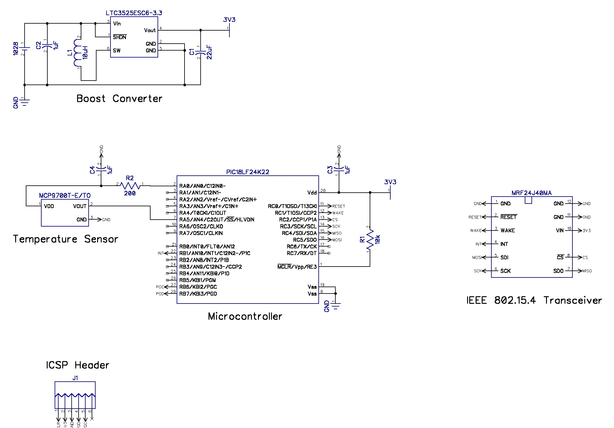

Gradusnik
=========

Gradusnik is an OSNP-compatible Thermometer for PIC18F14K50 + MRF24J40. This is the first project implementing the [OSNP](https://github.com/briksoftware/osnp) protocol and provides an example of how to use it.

Gradusnik is just above 9k when compiled with xc8 (Pro) for the PIC18F14K50 and includes the OSNP-stack, the MRF24J40 driver and the device-specific logic. Nonetheless, the entire OSNP protocol is implemented, including security.

You can use this project as basis to create your own OSNP-based device, performing other functions than sensing temperature.

## Schematics

These are the current schematics

Powering such a device with 3 AAA batteries and using an LDO is a waste of space and power respectively, but this what I did for the first revision's prototype, where the focus was on developing the software. The circuit has been realized on a matrix prototyping board using the THT version of all components.

The next revision of the board will be done on PCB, powered by 3v coin lithium battery using a charge pump IC able to deliver peaks of at least 30mA. The PCB design and updated schematics will be posted.

## Bill of materials

* 1x [PIC18(L)F14K50](http://www.microchip.com/wwwproducts/Devices.aspx?dDocName=en533924)
* 1x [MRF24J40MA](http://www.microchip.com/mrf24j40ma)
* 1x [MCP9700](http://www.microchip.com/wwwproducts/Devices.aspx?product=MCP9700)
* 1x [MAX884](http://www.maximintegrated.com/datasheet/index.mvp/id/1214)
* 1x 10k Resistor
* 1x 0.1µF Ceramic capitor
* 1x 1µF Ceramic capitor
* 1x 2.2µF Ceramic capitor
* 6x Header pins with 2,54mm spacing for the ICSP header 

## How to compile

A compile script will be added, but in the meantime you can compile it manually.

### Step 1: Download dependencies

* [OSNP Protocol Stack](https://github.com/briksoftware/osnp)
* [MRF24J40 Driver](https://github.com/briksoftware/mrf24j40)

You can either leave each project in its own folder or copy all the .c and .h files in the same folder (which is easier).

### Step 2: Create MPLAB X Project

Create an MPLABX project, choose PIC18F14K50 as target and select your programmer/debugger device. Import all source files. If you copied all source/header files in the same directory, you can just hit "compile" and you are done.

Otherwise you will have to play with the project settings and explictly add the include directories. The setup where each project mantains its own directory simplifies contributing your changes back.

Alternatively, you can invoke xc8 from the command line.

### Step 3: Customize

In the main.c file you will see the content of the EEPROM. It is advisable to change the 64-bit address (default: 703D6263962C9BF2) and the pairing key (default: 000102030405060708090A0B0C0D0E0F).

## How to use

Now you have a working Gradusnik, or whatever device you derived from it. Now the device can be used with any OSNP-compatible Hub, like [Uzel](https://github.com/briksoftware/uzel).

To pair the device with [Uzel](https://github.com/briksoftware/uzel), the pairing key is 000102030405060708090A0B0C0D0E0F, unless you did not change it in the EEPROM.
